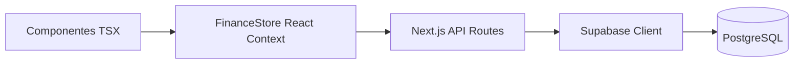

# 🧠 Marla Finance — System Overview

Este documento resume la arquitectura de la aplicación para que otros modelos de IA (como ChatGPT) puedan entender rápidamente el contexto del proyecto y la base de datos.

---

## 🚀 Stack Tecnológico
- **Framework**: Next.js 15+ (App Router).
- **Lenguaje**: TypeScript.
- **Base de Datos**: Supabase (PostgreSQL).
- **Estado Global**: React Context (`FinanceStore`) con actualizaciones optimistas.
- **Gráficos**: Recharts.
- **Estilos**: Tailwind CSS 4.

---

## 💰 Lógica de Negocio (`src/lib/finance.ts`)
La app gestiona las finanzas de una pareja (**Marcos** y **Camila**) con una lógica de prorrateo:

1.  **Gastos Compartidos (`scope: shared`)**: Se dividen **50/50**. En la vista personal de Marcos, un alquiler de 1000€ cuenta como 500€. En la vista de "Pareja", cuenta como 1000€.
2.  **Gastos Individuales (`scope: individual`)**: Solo cuentan en la vista de la persona que los realizó.
3.  **Categorías (`CategoryKind`)**:
    -   `income`: Ingresos (nóminas, etc.).
    -   `fixed`: Gastos fijos (Alquiler, Luz, Internet).
    -   `variable`: Gastos del día a día (Salidas, Supermercado).
    -   `saving`: Transferencias a ahorro.
    -   `investment`: Inversiones (Indexados, BTC, etc.).
4.  **Ahorro Acumulado**: Se calcula dinámicamente restando todos los gastos e inversiones de los ingresos, acumulando el remanente mes a mes.

---

## 🏗️ Arquitectura de Datos

### Flujo de Información

### 🗄️ Esquema de Base de Datos (Supabase)

#### Tabla: `users`
| Columna | Tipo | Descripción |
|---|---|---|
| `id` | text (PK) | 'marcos', 'camila', 'pareja' |
| `name` | text | Nombre visual |

#### Tabla: `categories`
| Columna | Tipo | Descripción |
|---|---|---|
| `id` | text (PK) | Ej: 'rent', 'salary' |
| `label` | text | Nombre de la categoría |
| `icon` | text | Emoji/Icono |
| `kind` | text | fixed, variable, saving, investment, income |
| `scope` | text | individual, shared |
| `limit_monthly` | integer | Límite en céntimos (opcional) |

#### Tabla: `transactions`
| Columna | Tipo | Descripción |
|---|---|---|
| `id` | text (PK) | UUID / nanoid |
| `created_at` | timestamptz | Timestamp de creación |
| `date` | date | Fecha del movimiento (YYYY-MM-DD) |
| `user_id` | text (FK) | Quién realizó el movimiento |
| `category_id` | text (FK) | A qué categoría pertenece |
| `amount_cents` | integer | Importe en céntimos (evita errores de coma flotante) |
| `note` | text | Nota opcional |
| `is_shared` | boolean | Override manual si es compartido (por defecto usa scope) |

---

## 🛣️ API Endpoints (`src/app/api/...`)
- `GET /api/transactions`: Lista todas las transacciones ordenadas por fecha.
- `POST /api/transactions`: Crea una nueva transacción.
- `PUT /api/transactions/[id]`: Actualiza una transacción existente.
- `DELETE /api/transactions/[id]`: Elimina una transacción.
- `GET /api/categories`: Lista las categorías disponibles.

---

## 🧠 Estado Global (`src/store/finance-store.tsx`)
El `FinanceStore` centraliza la sincronización:
- Al cargar, hace un `fetch` a `/api/transactions` y `/api/categories`.
- Al añadir/editar/borrar, realiza una **actualización optimista** (cambia la UI al instante) y lanza la petición en segundo plano. Si la petición falla, hace rollback del estado local para evitar inconsistencias.
